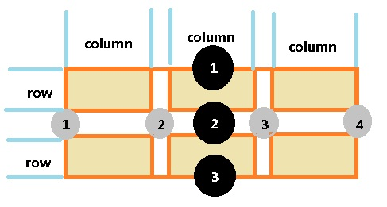

# 布局

## 一、网格布局（Grid Layout）
* __简要说明__  

    网格布局，其实就是用若干条横线和纵线交叉形成一个个格子，这些格子就是网格。通过这些网格位置控制布局，就是网格布局。所以说，网格布局就是先指定好一个个格子的位置和大小，然后，往格子里填内容，就达到了布局的目的。
    
* __网格布局示意图__

其中：
1.row和column表示行列轨道。
2.含有背景颜色的六个矩形块是六个网格，网格由行列轨道交叉形成。
3.相邻轨道之间的空白是间隔，有行列两种间隔。
4.有数字标号的表示网格线，在网格之间存在着分割线，这是网格线，它的宽为网格之间的间隔。
* __相关css属性__
    * ######声明
    * ######声明网格模板
    行列轨道用于确定网格的模板。它的属性为：
    ```css
    
    ```


