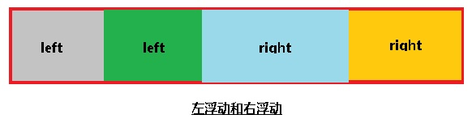
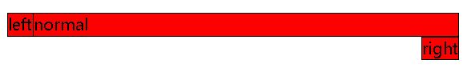
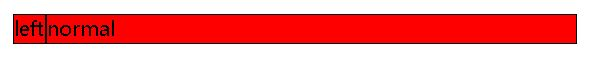

#浮动布局和定位布局

## 一、浮动布局
* __简要说明__

    浮动布局指的是使用浮动属性、浮动元素不重叠、宽度基于内容等特点以及清浮动手段，加上margin、padding等盒模型属性辅助元素定位的布局方式。
* __浮动布局示意图__

    
    其中：
    1.left表示左浮动，right表示右浮动。
    2.浮动元素不会覆盖浮动元素，所以漂浮元素按顺序排列。
    3.如果容器的宽度不足，元素会自动换行
    4.浮动元素不会撑开容器高度，需要清浮动才可以让容器高度自适应。
* __相关知识__
    * ######清浮动
    ```css
    /*方法一：clear清浮动*/
    .clearfix:after{
        content: '';
        display: block;
        clear: both; /*请除元素左右两边的浮动*/
    }
    /*方法二：overflow清浮动*/
    .overfw{
        overflow: hidden; /*形成BFC，计算浮动元素的高度*/
    }
    ```
    > 笔记：
    > 1.方法一的原理是在容器的子元素后面生成伪元素，然后让这个伪元素清除浮动
    > 2.方法二的原理是形成BFC，BFC会计算浮动元素的高度。其中，BFC是“块级格式化上下文”，把它理解成独立的一个块、一个空间（类似div）即可。但是，这个块比较特殊，它具有不会被浮动元素覆盖和计算容器中浮动元素高度的特点。
    > 3.形成BFC的方式是：脱离文档流，变成行内块级元素和溢出隐藏三种方式。
    * ######浮动元素与兄弟元素
    浮动元素是否遮盖非浮动兄弟元素其中一个依据是它们在在dom树（html文档）中的先后顺序。
    ```html
    <div class="left">left</div>
    <div class="normal">normal</div>
    <div class="right">right</div>
    ```
    ```css
    div{
        background-color: red;
        border: 1px solid black;
    }
    .left{
        float: left;
    }
    .right{
        float: right;
    }
    ```
    上面代码的结果是
    
    其中normal被left遮盖
    
    > 笔记：
    > 1.left先渲染，由于其浮动所以脱离文档流，然后到渲染normal，填充了left在文档流中空出来的位置，又由于它是块级元素，填满整行空间。最后，渲染right，由于整行空间被normal填满，所以right只能换行，然后右浮动。
    > 2.在html中和normal调换顺序，可以发现left和right都遮盖了normal，因为它们先渲染，脱离文档流，腾出了空间。
    
    另一个依据就是浮动元素不遮盖inline元素和BFC。
    ```html
    <div class="left">left</div>
    <div class="normal">normal</div>
    ```
    ```css
    div{
        background-color: red;
        border: 1px solid black;
    }
    .left{
        float: left;
    }
    .normal{
        overflow: hidden; /*形成BFC*/
    }
    ```
    结果为：
    
    其中left不遮盖normal，normal的宽度自适应为100%减去left的宽度。
    
    >笔记：
    >1.利用浮动元素不遮盖BFC的特点，可以使用BFC元素在浮动布局中的宽度自适应
    >2.除了BFC外，行元素一样不能被浮动元素遮盖。
    >3.要实现这样的自适应布局，渲染顺序也很重要，像这个例子，调换连个div的顺序，会导致left换行。
    
## 二、定位布局

* __简要说明__
    
    定位布局是一种相对于参照物进行定位的布局。

* __定位布局示意图__
    
    

    